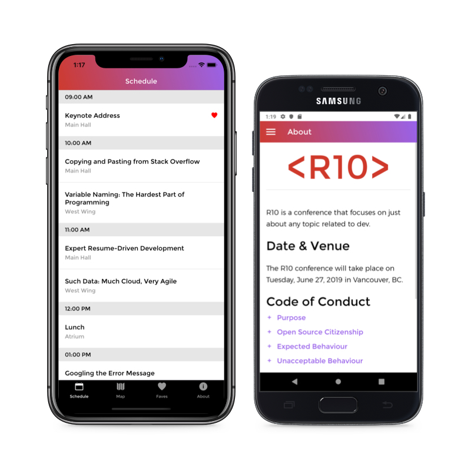
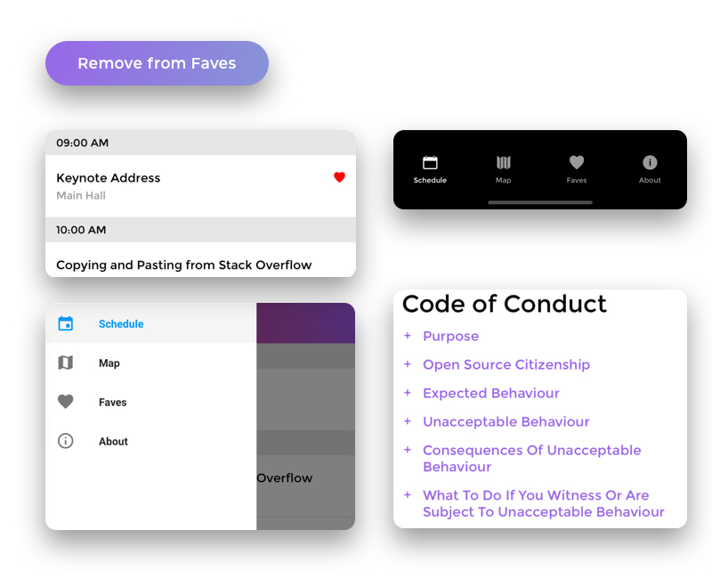
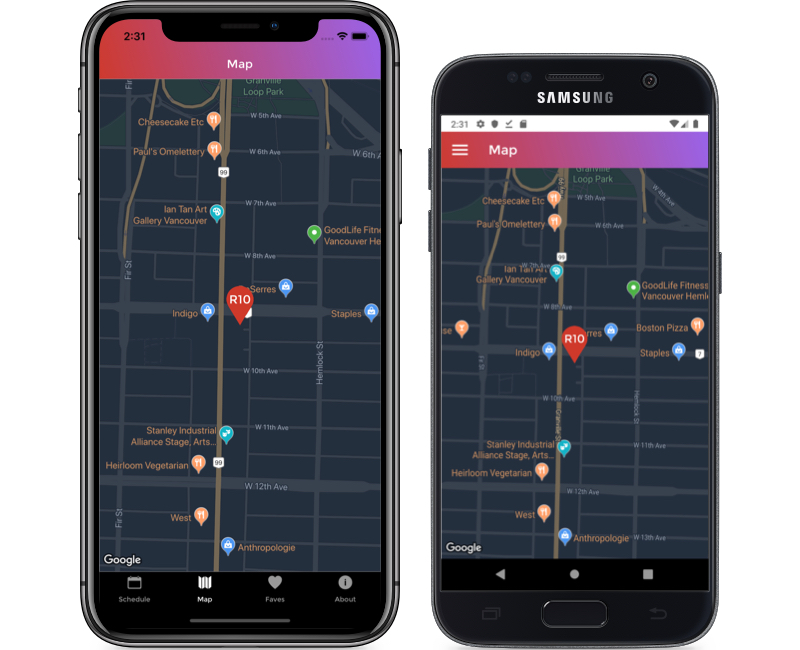

# R10 Developer Conference App for Mobile

The iOS/Android React Native mobile app for developer conference called R10.



[](https://facebook.github.io/react-native/)
[](https://www.apollographql.com/)
[](#)
[](#)
[](#)

[](https://lbesson.mit-license.org/)
&nbsp;

&nbsp;

## Installation
>(iOS) Install Xcode before start &nbsp;

>(Android) Install Android Studio

&nbsp;

1. Install dependencies
&nbsp;

    `yarn install` or  `npm install`

&nbsp;

2. Start your emulator
&nbsp;

    **iOS**
    ```
    npm run run:ios
    ```
    or
    ```
    yarn run:ios
    ```

    **Android**

    ```
    npm run run:android
    ```
    or
    ```
    yarn run:android
    ```
&nbsp;

&nbsp;

## React Components

To reflect the designer's vision for the application UI, reusable react components are developed.

&nbsp;

**1. Screens**

- All screens are stateful components that produce or contain data for their children components.
  

**2. Buttons / Icons / Tabs**

- Reusable components are separated and independent from the code of its screen.

&nbsp;

&nbsp;

## Customizing Google Map



See [Basic Installation Instructions](https://github.com/react-native-community/react-native-maps/blob/master/docs/installation.md). 

&nbsp;

**1. Set Global Variables**

- Store private API key safe by setting global variables.

    - **iOS**
        1. Create `GlobalVar.h`, `GlobalVar.m` in `./ios/[YOUR PROJECT NAME]/`
        
        2. Add these lines in `GlobalVar.h`

            ```C
            #import <Foundation/Foundation.h>

            extern NSString *const gGoogleMapAPI; 
            ```
        
        3. Assign variables in `GlobalVar.m`

            ```C
            #import "GlobalVar.h"

            NSString *const gGoogleMapAPI=@"[YOUR API KEY]";
            ```

        4. Include `GlobalVar.h` in `./ios/[YOUR PROJECT NAME]/AppDelegate.m`

            ```C
            #import "AppDelegate.h"
            ...
            ...
            ...
            #import <GoogleMaps/GoogleMaps.h>
            #include "GlobalVar.h"

            @implementation AppDelegate

            - (BOOL)application:(UIApplication *)application didFinishLaunchingWithOptions:(NSDictionary *)launchOptions
            {

            [GMSServices provideAPIKey: gGoogleMapAPI]; <!-- ADD HERE -->
            ...

            }

            ...

            @end
            ```
    &nbsp;

    - **Android**

        1. Create `global_vars.xml` in `./android/src/main/res/values`

        2. Add these lines

            ```xml
            <?xml version="1.0" encoding="utf-8"?>
            <resources>
                <string name="google_maps_key" templateMergeStrategy="preserve" translatable="false">YOUR API KEY</string>
            </resources>
            ```

        3. Open `AndroidManifest.xml` and add your api key as `string`

            ```xml
            <manifest xmlns:android="http://schemas.android.com/apk/res/android" package="com.p4_r10">

                <uses-permission android:name="android.permission.INTERNET" />

                <application>

                    ...

                    <meta-data
                        android:name="com.google.android.geo.API_KEY"
                        android:value="@string/google_maps_key"/> <!-- ADD HERE -->
                    
                </application>

            </manifest>

            ```

&nbsp;

**2. Add Custom Markers**

1. Import `MapView`, `Marker` components from `react-native-maps`
    
    ```js
    import MapView, {Marker} from 'react-native-maps';
    ```

2. Wrap `Marker` components with `MapView` and add Image to customize

    ```js
    <MapView region={this.state.region}>

        <Marker coordinate={this.state.marker.region}>

          <Image source={require('../../assets/images/map_pin.png')} />

        </Marker>

    </MapView>
    ```

&nbsp;

**3. Calculate Maginification**

- `latitudeDelta`, `longitudeDelta` properties of MapView API are easily calculated with Dimensions component of React Native.

    ```js
    import React, {Component} from 'react';
    import {Dimensions} from 'react-native';
    import MapView, {Marker} from 'react-native-maps';

    // Setting the scale of GoogleMap
    let {width, height} = Dimensions.get('window');
    const ASPECT_RATIO = width / height;
    const LATITUDE = 49.2633483;
    const LONGITUDE = -123.1381264;
    const LATITUDE_DELTA = 0.008;
    const LONGITUDE_DELTA = LATITUDE_DELTA * ASPECT_RATIO;

    class Map extends Component {
    constructor(props) {
        super(props);

        this.state = {
        region: {
            latitude: LATITUDE,
            longitude: LONGITUDE,
            latitudeDelta: LATITUDE_DELTA,
            longitudeDelta: LONGITUDE_DELTA,
        },
        marker: {
            region: {
            latitude: LATITUDE,
            longitude: LONGITUDE,
            },
        },
        };
    }

    render() {
        return (
        <MapView
            style={{flex: 1}}
            region={this.state.region}>
        </MapView>
        );
    }
    }

    export default Map;
    ```

&nbsp;

**4. Customizing the map style**

- Use [google style generator](https://mapstyle.withgoogle.com/) and follow instructions on the [docs](https://github.com/react-native-community/react-native-maps#customizing-the-map-style)

&nbsp;

&nbsp;

## App icons, Splash screens


&nbsp;

&nbsp;
## License
- Structural code is open-sourced under the [MIT license](/LICENSE.md). 
&nbsp;

- Learning materials content is copyright (c) 2019 RED Academy.

<3